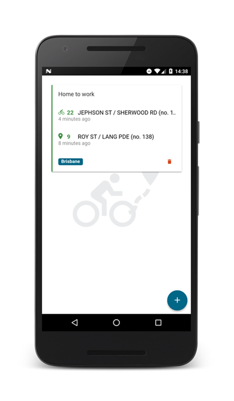
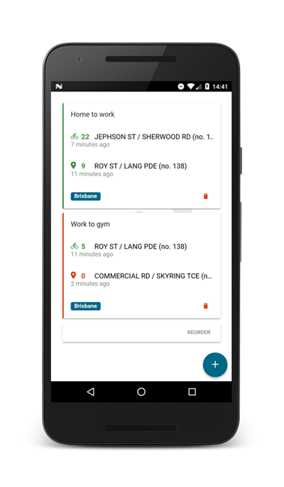

# City Bike Routes

Save your favorites routes in many cities' bike sharing services. See in one second if the route you usually take is available or not by automatically checking the remaining bikes and parking places.

Current available cities: 

- Amiens (Velam)
- Besancon (VéloCité)
- Brisbane (CityCycle)
- Bruxelles (Capitale villo)
- Cergy (PontoiseVelo2)
- Creteil (Cristolib)
- Dublin (Dublinbikes)
- Goteborg (Göteborg)
- Kazan (Veli'k)
- Lillestrom (Bysykkel)
- Ljubljana (Bicikelj)
- Lund (Lundahoj)
- Luxembourg (Veloh)
- Lyon (Vélo'V)
- Marseille (Le vélo)
- Mulhouse (VéloCité)
- Namur (Li bia velo)
- Nancy (VélOstan'lib)
- Nantes (Bicloo)
- Paris (Velib)
- Rouen (Cy'clic)
- Santander (Tusbic)
- Seville (Sevici)
- Stockholm (Cyclocity)
- Toulouse (Vélô)
- Toyama (Cyclocity)
- Valence (Valenbisi)
- Vilnius (Cyclocity)

## Screenshots

